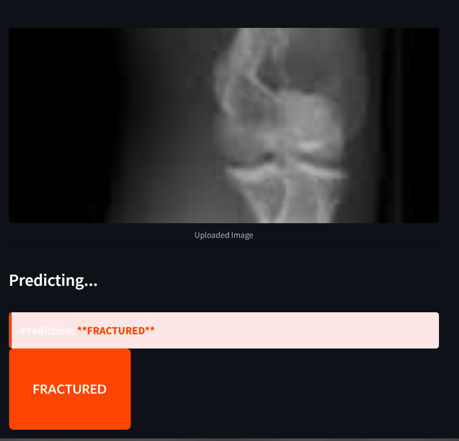

# Bone Fracture Detection using Machine Learning

## Project Overview
This project aims to detect bone fractures from X-ray images using computer vision and machine learning techniques.
The implementation involves 
            preprocessing the images,
            extracting features using SIFT (Scale-Invariant Feature Transform), 
            clustering these features using MiniBatchKMeans to create a visual vocabulary, 
            training an SVM (Support Vector Machine) classifier for fracture detection,
            and a Streamlit web app for interactive predictions


## Contents
- `Bone_Fracture_Binary_Classification`:
        The dataset consists of X-ray images categorized into two classes:
            fractured: Images containing bone fractures.
            not fractured: Images without any fractures.
        The dataset is organized into three directories:
            train: Training images.
            val: Validation images.
            test: Test images.

        ├── Bone_Fracture_Binary_Classification/ # Dataset directory
        │ ├── train/ # Training images
        │ │ ├── fractured/          # Fractured cases
        | │ └── not_fractured/      # Normal cases
        | |
        | ├── val/ # Validation images 
        │ │ ├── fractured/ 
        │ │ └── not_fractured/ 
        | |
        | ├── test/ # Test images 
        │ │ ├── fractured/ 
        │ │ └── not_fractured/ 
        
- `Bone-Fracture-Project.ipynb`: Jupyter Notebook for model development using Sift algorithm
- `StreamlitApp.py`: Streamlit app to interact with the trained model
- `requirements.txt`: List of dependencies to run the project
- `README.md`:  Project documentation

## features
    1. Image Preprocessing:
        Resizing images to a standard dimension (256x256).
        Applying Gaussian blur and adaptive thresholding to enhance features.
        Generating bone masks to focus on relevant regions.

    2. Feature Extraction:
        Using SIFT to detect keypoints and extract descriptors from the images.

    3. Visual Vocabulary:
        Clustering SIFT descriptors using MiniBatchKMeans to create a visual vocabulary (100 words in this implementation).

    4. Bag of Words (BoW) Model:
        Creating histograms of visual word occurrences for each image to represent them in a fixed-length feature vector.

    5. Classification:
        Training an SVM with an RBF kernel on the BoW features.
        Evaluating the model on validation and test sets.

    6. Web Interface
        Interactive Streamlit application
        Upload and classify new X-ray images
        Visualize predictions with confidence scores

## Results
    Validation Accuracy: 92.52%
    Test Accuracy: 94.86%


### 1. Clone the repository
```bash
git clone https://github.com/salmaamohamed/Bone-Fracture-Detection
cd bone-fracture-predictions


Install dependencies
pip install -r requirements.txt

Run the Streamlit app
streamlit run StreamlitApp.py


## Contact
For questions or collaborations, please contact:

    vsalma.mohamed24@gmail.com
    https://github.com/salmaamohamed/Bone-Fracture-Detection